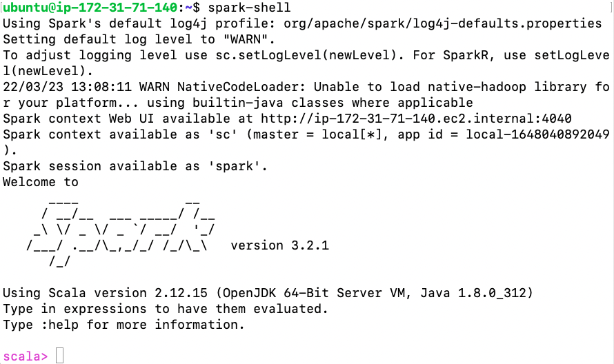

# Spark3 Pseudo Cluster Installation on Ubuntu20.04

This is a guide for Spark3 Pseudo Cluster Mode (One Node) installation on Ubuntu 20.04

## Step 1 - Install Java

If java is not installed on your servers, you can install java by following the instructions in;&#x20;

NOTE: We will be using java 8 for this project.&#x20;



## Step 2 - Install Apache Spark

* [x] Download Apache Spark

```
wget https://dlcdn.apache.org/spark/spark-3.2.1/spark-3.2.1-bin-hadoop3.2.tgz
```

* [x] Extract the file

```
tar xvf spark-3.2.1-bin-hadoop3.2.tgz
```

* [x] Move the extracted file to the opt directory

```
sudo mv spark-3.2.1-bin-hadoop3.2 /opt/
```

* [x] Open .bashrc file

```
nano ~/.bashrc
```

* [x] Add following lines into .bashrc file

```
export SPARK_HOME=/opt/spark-3.2.1-bin-hadoop3.2 
export PATH=$PATH:$SPARK_HOME/bin:$SPARK_HOME/sbin
export PYSPARK_PYTHON=/usr/bin/python3
```

* [x] Source .bashrc file to apply the changes&#x20;

```
source ~/.bashrc
```

* [x] Run Spark

```
cd /opt/spark-3.2.1-bin-hadoop3.2

./sbin/start-master.sh
./sbin/start-slave.sh
```

* [x] Check the status of your pseudo cluster over spark UI. Go to your browser and type  http://\<IP-ADDRESS>:8080

## Step 4 - Spark with Python

* [x] Run the script written below to start coding with Python on Spark.

```
pyspark
```

* [x] The output

.png>)


## Step 5 - Spark with Scala

* [x] Run the script written below to start coding with Scala on Spark.

```
spark-shell
```

* [x] The output



## Congratulations :)

Your Spark is up and running !!!
